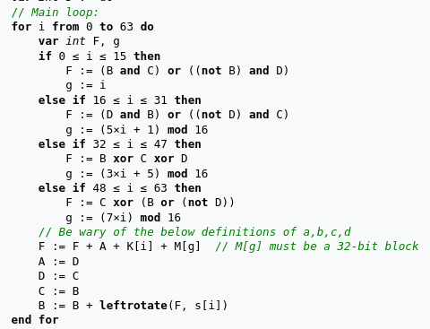
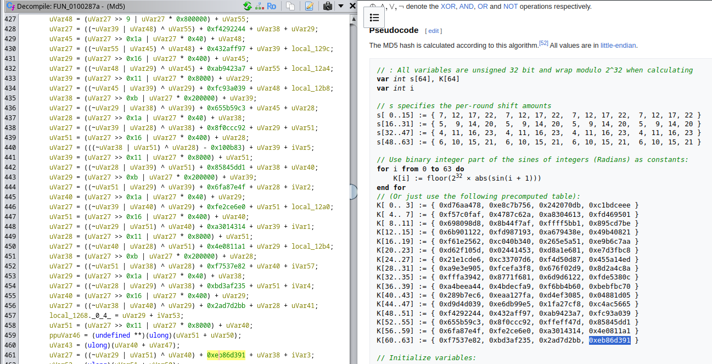
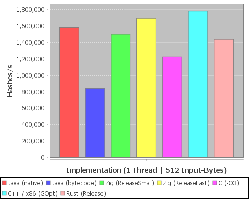
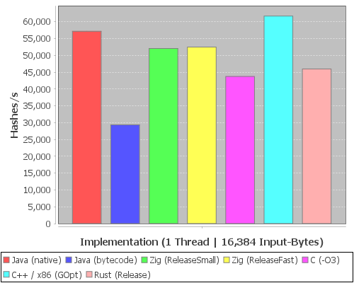
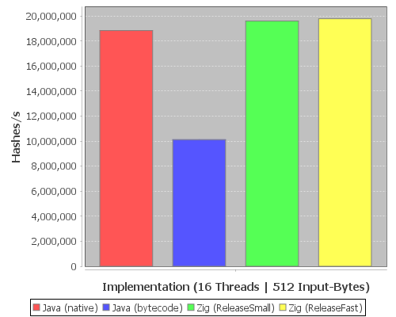
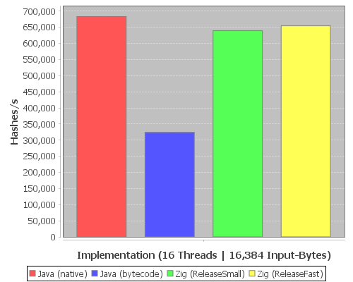
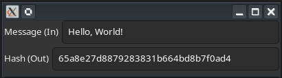
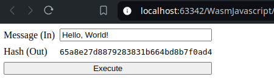
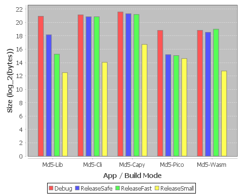
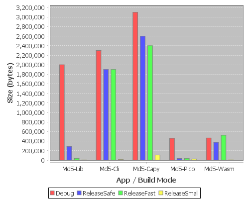

+++
title = "Zig: Build tiny, high performance executables with a modern language"
date = "2024-08-19"
authors = ["eric.jarosch"]
tags = ["Teaching", "EPEA 2024", "Zig", "Cross-Platform"]
+++

Zig is a rapidly evolving, modern, general-purpose programming language, most notable for its performance, safety and platform-compatibility.

In this article, I will cover how to build applications for embedded hardware, Linux/Windows, as well as Web-Browsers.\
I will also present Benchmark comparisons with C, C++, Rust and Java.

<!--more-->

Since its first release in 2017, Zig has received 29.000 commits, and is still receiving several commits per day.

Despite the language still being in its infancy, there already exist some notable projects written in Zig:
- [bun](https://github.com/oven-sh/bun) - that's right, the "incredibly fast" JS runtime and package manager is written in Zig.
- [xmake](https://github.com/xmake-io/xmake) - xmake is a modern C/C++ build tool that uses `.lua` files to define the build process. It also supports building projects written in Go, Zig, Rust and several other languages.
- [tigerbeetle](https://github.com/tigerbeetle/tigerbeetle) - a database written from scratch, optimized for financial transactions, where safety and performance are critical.\
The Business-logic is contained in a single `state_machine.zig` file, which - in theory - could be replaced to create a database serving any other purpose.
- [river](https://github.com/riverwm/river) - a dynamic tiling window manager for Wayland.\
I'm not too familiar with tiling WMs, but as far as I can tell, the key sales points are:\
*dynamic* = new windows are arranged into the grid automatically\
*scriptable* = the layouts, rules and appearance are configured through a `riverctl` command

<br/>

## Interesting Language Aspects and Syntax

### Arbitrary Width Integers

Signed and unsigned Integers can be declared using `i<width>` and `u<width>`.  
The maximum supported width is `65535` bits.

Examples:
```zig
const u5_min_max = [_]u5{0, 31};
const i17_min_max = [_]i17{-65536, 65535};
const invalid: u3 = 8;
```

#### Packed Structs

Packed structs have guaranteed in-memory layout:

For example, for this packed struct it is guaranteed that 'a' comes before 'b' in memory, and that the entire struct will take up 8 bits.
```zig
packed struct {
    a: u3,
    b: i5,
}
```

#### Converting Between Different Data Types

There are several options for type conversions:
- Type Coercion
    - Is guaranteed to be safe (read: no detail is lost)
    - Integer and Float widening (e.g. `const a: u3 = 7;` \n `const b: i4 = a;`)
    - Compile-Time Known Numbers (e.g. `const a: u64 = 255;` \n `const b: u8 = a;`)
    - There are more Coercion-Rules for Slices, Arrays, Tuples, Pointers, Optionals, Unions and Enums.
- Explicit Casts
    - `@as`, performs an explicit type coercion. E.g. `const a = @as(u8, 255)`
    - `@bitCast`, e.g. from `f32` to `u32`: `const a: u32 = @bitCast(@as(f32, 8.5));`
    - `@truncate`, e.g. `const a: u4 = @truncate(0b1111_0001)` -> `a = 1`
    - And many more. In general: if the conversion is deemed unsafe (lossy), you have to use an explicit cast.
- Peer Type Resolution
    - Determines a coercion of multiple source types into one target type.
    - For example: `a = @as(u3, 4) + @as(u4, 11)` would result in `a: u4 = 15`

### Tuples

Tuples are anonymous structs whose fields are named using numbers starting from 0.  
Fields are accessed similar to arrays, using indices.

```zig
const tuple = .{
    @as(u32, 1234),
    @as(f64, 12.34),
    true,
    "hi",
};

try expectEqual(tuple[0], 1234);
try expectEqual(tuple[1], 12.34);
try expectEqual(tuple[2], true);
try expectEqual(tuple[3], "hi");
```

### Error Handling

The Error Handling in Zig is not necessarily unique, but too in-depth to not be mentioned.  
Errors in Zig are eerily similar to Exceptions (not `RuntimeExceptions`) in Java, in that any function that can produce errors must declare them in its function definition.  
However less like Java and moreso like C or Rust, errors are just return values of functions.

As such, you might define a function that returns multiple possible errors or a value like this:
```zig
fn parseInt(str: ?[*]u8) error{NullPointer, NotANumber}!i32
```
The `!` operator declares an 'error union type', meaning that either an error or a value must be present, but not both at the same time.

The fundamental syntax for error handling is:
```zig
if(failingFn()) |result| <successExpression> else |err| <errorExpression>
```
This branches on whether the error union contains a value or an error.  
Each branch captures the corresponding value using `|x|`.  

The Keywords `catch`, `try` build syntactic sugar on top of it.  
Each pair of these lines behaves the same:
```zig
failingFn() catch "defaultValue"
if(failingFn()) |result| result else |_| "defaultValue"

try failingFn()
if(failingFn()) |result| result else |err| return err
```

### Defer

You may be familiar with this keyword from 'Go', however unlike in Go, deferred expressions are executed at **scope** exit.

So this will print `123` in order.
```zig
{
    defer print("2", .{});
    print("1", .{});
}
print("3", .{});
```

Similarly, `errdefer` expressions are executed at scope exit, but only if the function **returned an error from within the scope-block**.

```zig
fn notExecuted() !void {
    {
        errdefer print("not printed", .{});
    }
    return error.ErrorOutsideScope;
}

fn isExecuted() !void {
    {
        errdefer print("is printed", .{});
        return error.ErrorInsideScope;
    }
}
```

### Comptime

#### Compile-time Expressions

Comptime expressions, as the name implies, are evaluated at compile time.  

```zig
fn fibonacci(index: u8) u8 {
    if (index < 2) return index;
    return fibonacci(index - 1) + fibonacci(index - 2);
}

pub fn main() !u8 {
    return comptime fibonacci(7);
}
```

will compile to
```zig
pub fn main() !u8 {
    return 13;
}
```

#### Generics Using Compile-time Parameters

Types can be passed to functions as parameters, provided that they are known at compile-time.

```zig
fn max(comptime T: type, a: T, b: T) T {
    if (T == bool)
        return (a or b);

    return if (a > b) a else b;
}

pub fn main() !void {
    print("max(true, false)={}\n", .{max(bool, true, false)});
    print("max(5, 15)={}\n", .{max(u4, 5, 15)});
}
```

Since the `type` parameter (T) must be known at Compile-Time, the Compiler is able to generate these two functions:
```zig
fn max(a: bool, b: bool) bool {
    return a or b;
}

fn max(a: u4, b: u4) u4 {
    return if (a > b) a else b;
}
```

<br/>

## Notable design decisions

### Integer Overflow

The "normal" arithmetic operators (`+`, `-`, `*`, `/`) treat overflow as an error.  
If overflow is detected at compile-time, compilation will abort.  
If overflow is detected at runtime, the thread will panic.

If overflow is desired, there are 'Wrapping' Operands: `+%`, `-%` and `*%`.

If overflow is allowed, and you want to detect overflow, there are builtin functions:  
`@addWithOverflow`, `@subWithOverflow` and `@mulWithOverflow`.  
For example:
```zig
const ov = @addWithOverflow(@as(u3, 7), 5);
print("result: {}, didOverflow: {}\n", .{ov[0], ov[1]});
```
will print `result: 4, didOverflow: 1`

### Allocators

The most notable difference to C is that there is no default allocator (`malloc`).  
When writing functions the difference is subtle: if the function needs to allocate memory, it should accept an Allocator as a parameter.  
But when calling functions that allocate memory, Zig forces you to consider where you allocate memory and how it is managed.

To that end, there are several builtin allocators, such as:
- `FixedBufferAllocator` populates the buffer like a stack. Only the most recently allocated block can be freed at a time.
- `ArenaAllocator` wraps another allocator, but all allocated memory is freed at once.
- `GeneralPurposeAllocator` and allocator that can free in any order. The stated performance goals are low fragmentation and low worst-case latency.
- `CAllocator` the default C allocator, exposed only if you are linking LibC.

You can also create your own allocator by implementing the Allocator interface:
```zig
pub const VTable = struct {
    alloc: *const fn (ctx: *anyopaque, len: usize, ptr_align: u8, ret_addr: usize) ?[*]u8,

    resize: *const fn (ctx: *anyopaque, buf: []u8, buf_align: u8, new_len: usize, ret_addr: usize) bool,

    free: *const fn (ctx: *anyopaque, buf: []u8, buf_align: u8, ret_addr: usize) void,
};
```

This seems like a good opportunity to look at a simple example of interfaces and generic types.  
Suppose you want to define a generic "Mapper" similar to what you're familiar with from functional programming languages.
```zig
fn Mapper(comptime A: type, comptime B: type) type {
    return struct {
        map: *const fn (a: A) B,
    };
}
```
`Mapper` is a generic interface that provides a `map` function.  
This is possible since `Mapper` is a comptime executable function that returns a type.  
You can then use this type as the return type of another function:
```zig
pub fn DoubleIt(comptime T: type) Mapper(T, T) {
    const implementation = struct {
        fn map(a: T) T {
            return a * 2;
        }
    };

    return Mapper(T, T){ .map = implementation.map };
}
```
`DoubleIt` returns a Mapper implementation that doubles the numerical value of the input.  
The compiler will throw an error if a type `T` is passed in for which the `*` operator is not implemented (anything other than integers and floats).  

Naturally, you can also use the Mapper type as a function parameter:
```zig
fn mappedIntegersFromZero(comptime length: usize, comptime Int: type, mapper: Mapper(Int, Int)) [length]Int {
    var result: [length]Int = undefined;
    for (0..length) |i| {
        result[i] = mapper.map(@intCast(i));
    }
    return result;
}
```
When called with `(4, i16, DoubleIt(i16))`, this will return the array `{0, 2, 4, 6}`.

### Builtin Test Support

Unlike with most programming languages, Zig has a builtin testing framework and tests are allowed to be part of the Container (`.zig` file) under test.  
This has several advantages: tests are easy to find, and you don't have to mirror your source-code directory structure into a separate 'test' directory. Another direct consequence of this, is that many of the Zig source files contain tests which provide always-valid and always-up-to-date code-as-documentation for how to use them.  

Here are some exemplary tests for Language Aspects covered so far:
```zig
const std = @import("std");
const expectEqual = std.testing.expectEqual;

test "u5 overflows to 0" {
    const val: u5 = 31;
    try expectEqual(0, val +% 1);
}

test "sizeof packed struct {u3, i5} is 1 byte" {
    const TestStruct = packed struct {
        a: u3,
        b: i5,
    };
    try expectEqual(1, @sizeOf(TestStruct));
}

test "defer executes at scope exit" {
    const Buffer = struct {
        var data: [3]u8 = undefined;
        var i: usize = 0;

        fn push(value: u8) void {
            data[i] = value;
            i += 1;
        }
    };

    {
        defer Buffer.push(2);
        Buffer.push(1);
    }
    Buffer.push(3);

    try expectEqual([_]u8{ 1, 2, 3 }, Buffer.data);
}
```

<br/>

## Performance at a Glance

### Multithreading

Zig provides a Multithreading abstraction.  
The actual Threading implementation is platform dependent.  
There are dedicated implementations for Windows, Linux and WebAssembly.  
For other Operating Systems, Posix is used, if available.

Let's have a look at how to implement a n-producers-to-m-consumers problem.  
I first declare some global constants and a data-type for shared data between all threads:
```zig
const buffer_len = 10;
const num_producers = 5;
const num_producer_items = 5;
const num_consumers = 3;

const SharedData = struct {
    buffer: *[buffer_len]u8,
    buffer_end: *usize,
    buffer_lock: *Mutex,
    empty_buffer_slots: *Semaphore,
    filled_buffer_slots: *Semaphore,
    producers_left: *usize,
};
```

Then I implement the producer Thread:
It generates a random number to push onto the buffer, waits for a slot to become available, pushes the number and finally notifies the consumers that a slot was filled.
```zig
const ProducerInfo = struct {
    data: *const SharedData,
    index: usize,
};

fn producer(info: *ProducerInfo) void {
    var rng = Random.init(@intCast(info.index));
    var data = info.data;
    for (0..num_producer_items) |_| {
        const item: u8 = @truncate(rng.next());

        data.empty_buffer_slots.wait();
        data.buffer_lock.lock();

        print("producer {} stores {} in slot {}\n", .{ info.index, item, data.buffer_end.* });
        data.buffer[data.buffer_end.*] = item;
        data.buffer_end.* += 1;

        data.buffer_lock.unlock();
        data.filled_buffer_slots.post();
    }

    data.buffer_lock.lock();
    data.producers_left.* -= 1;
    data.buffer_lock.unlock();
}
```

I implemented the consumer Thread in a similar fashion.  
One noteworthy thing happened here though: it's surprisingly finicky to stop the consumer threads once the workload is complete.  
There does not seem to be a way to force-stop threads.
```zig
const ConsumerInfo = struct {
    data: *const SharedData,
    index: usize,
};

fn consumer(info: *ConsumerInfo) void {
    var data = info.data;
    while (true) {
        while (true) {
            data.filled_buffer_slots.timedWait(time.ns_per_ms * 10) catch {
                if (data.producers_left.* == 0) {
                    return;
                }
                continue;
            };
            break; // if semaphore released a permit, break waiting loop
        }

        data.buffer_lock.lock();

        data.buffer_end.* -= 1;
        const item = data.buffer[data.buffer_end.*];
        print("consumer {} took {} from slot {}\n", .{ info.index, item, data.buffer_end.* + 1 });

        data.buffer_lock.unlock();
        data.empty_buffer_slots.post();

        // slow down the consumer threads so that producers run out of buffer space
        time.sleep(time.ns_per_s);
    }
}
```

Finally, we can spawn multiple Threads and point them at these functions.  
Here the initialization is a little clunky because arguments are immutable, so the shared data must be passed as a pointer, which in turn must store their data *somewhere* (on the function stack, in this case).  
It also would have been possible to use an allocator here.
```zig
pub fn main() !void {
    var buffer: [buffer_len]u8 = undefined;
    var buffer_end: usize = 0;
    var buffer_lock = Mutex{};
    var empty_buffer_slots = Semaphore{ .permits = buffer_len };
    var filled_buffer_slots = Semaphore{ .permits = 0 };
    var producers_left: usize = num_producers;

    var data = SharedData{
        .buffer = &buffer,
        .buffer_end = &buffer_end,
        .buffer_lock = &buffer_lock,
        .empty_buffer_slots = &empty_buffer_slots,
        .filled_buffer_slots = &filled_buffer_slots,
        .producers_left = &producers_left,
    };

    var producer_infos: [num_producers]ProducerInfo = undefined;
    var producer_handles: [num_producers]Thread = undefined;
    for (&producer_infos, 0..) |*info, index| {
        info.data = &data;
        info.index = index;
        producer_handles[index] = try Thread.spawn(.{}, producer, .{info});
    }

    var consumer_infos: [num_consumers]ConsumerInfo = undefined;
    var consumer_handles: [num_consumers]Thread = undefined;
    for (&consumer_infos, 0..) |*info, index| {
        info.data = &data;
        info.index = index;
        consumer_handles[index] = try Thread.spawn(.{}, consumer, .{info});
    }

    for (&producer_handles) |*handle| {
        handle.join();
    }
    for (&consumer_handles) |*handle| {
        handle.join();
    }
    const total_items = num_producers * num_producer_items;
    print("completed producing {} items\n", .{total_items});
}
```

### Vectors / SIMD

SIMD instructions are executed by a single CPU Core, so they offer another degree of parallelism on top of Multithreading.  

Zig supports SIMD operations through Vectors of Integers, Floats, booleans and Pointers, provided that the length of the Vector is known at compile-time.  
All operations of the underlying type can be used on a Vector, Zig will generate SIMD instructions where possible, otherwise the operation is performed element-wise.

Example Code:
```zig
fn vectorXor(len: comptime_int, a: @Vector(len, u4), b: @Vector(len, u4)) @Vector(len, u4) {
    return a ^ b;
}

fn arrayXor(len: comptime_int, a: [len]u4, b: [len]u4) [len]u4 {
    var result: [len]u4 = undefined;
    for (0..len) |i| {
        result[i] = a[i] ^ b[i];
    }
    return result;
}

test "vector xor" {
    const a = [_]u4{ 0, 1, 2, 3, 4, 5, 6, 7, 8, 9, 10, 11, 12, 13, 14, 15 };
    const b = [_]u4{0xf} ** 16;
    const vec_result = vectorXor(a.len, a, b);
    const arr_result = arrayXor(a.len, a, b);
    try expectEqual(@as([16]u4, vec_result), arr_result);
}
```

### Benchmarking a Simple Algorithm

To get a feel for the language, I implemented the MD5 hash algorithm in Zig.  
Here are some things I would consider worth mentioning.

We can use container-level expressions (these implicitly are `comptime`) to compute complex data at compile time:
```zig
const s_table: [64]u5 = init: {
    const shift_table = .{
        [_]u5{ 7, 12, 17, 22 }, //
        [_]u5{ 5, 9, 14, 20 }, //
        [_]u5{ 4, 11, 16, 23 }, //
        [_]u5{ 6, 10, 15, 21 }, //
    };

    var result: [64]u5 = undefined;
    for (0..4) |table_index| {
        for (table_index * 16..(table_index + 1) * 16) |i| {
            result[i] = shift_table[table_index][i % 4];
        }
    }
    break :init result;
};

const k_table = init: {
    var result: [64]u32 = undefined;
    for (&result, 0..) |*p, i| {
        p.* = @as(u32, @floor((1 << 32) * @abs(@sin(@as(f64, i) + 1))));
    }
    break :init result;
};
```

We can also use `inline` and `comptime` to implement this part of the algorithm in a 'DRY', branchless fashion.\
<div style="display: grid; grid-template-columns: repeat(1, min(480px, 90vw))">
    
    <center><sup><sub>source: https://en.wikipedia.org/wiki/MD5</sub></sup></center>
</div>

```zig
inline for (0..4) |round| {
    inline for (round * 16..(round + 1) * 16) |i| {
        const g = comptime switch (round) {
            0 => undefined,
            1 => ((5 * i) + 1) & 0x0f,
            2 => ((3 * i) + 5) & 0x0f,
            3 => (7 * i) & 0x0f,
            else => unreachable,
        };
        const f = switch (round) {
            inline 0 => ((b & c) | (~b & d)) +% buffer[i],
            inline 1 => ((d & b) | (~d & c)) +% buffer[g],
            inline 2 => (b ^ c ^ d) +% buffer[g],
            inline 3 => (c ^ (b | ~d)) +% buffer[g],
            else => unreachable,
        } +% a +% k_table[i];

        a = d;
        d = c;
        c = b;
        const shift: u5 = s_table[i];
        b = b +% ((f << shift) | (f >> (~shift +% 1)));
    }
}
```

Checking with Ghidra, it is clear that the k-table and switch-expressions were evaluated at compile time:  


I also implemented the algorithm in Rust and Java to get a comparison.  
(Note, I'm obviously not proficient in Zig or Rust, so consider this the benchmark-expectation for laymen)

For the C benchmark I used [this implementation](https://gist.github.com/creationix/4710780) with `gcc -Wall -Wextra -O3 -lm -o md5 md5.c`.  
I also tried [this implementation](https://github.com/Zunawe/md5-c), but it was slower.

For the C++ benchmark I used [this implementation](https://github.com/animetosho/md5-optimisation) which makes use of hand-optimized X86 Assembly.

Each benchmark computed `2^21` (~2 Million) hashes.\
I did not bother with implementing multi-threaded benchmarks for C, C++ and Rust.

<div style="display: grid; grid-template-columns: repeat(2, 1fr); grid-template-rows: repeat(2, 1fr); gap: 2ch;">
   <div>
      <h4>1 Thread, 512 Input Bytes</h4>
      
   </div>
   <div>
      <h4>1 Thread, 16384 Input Bytes</h4>
      
   </div>
   <div>
      <h4>16 Threads, 512 Input Bytes</h4>
      
   </div>
   <div>
      <h4>16 Threads, 16384 Input Bytes</h4>
      
   </div>
</div>

Unsurprisingly, the implementation using optimized Assembly leads the pack.\
Slightly more surprising was the performance of the native Java implementation. I was unable to replicate its performance by copying the corresponding source code into my own project, so I have to assume the JVMs C2 compiler applies additional optimizations specific to the native Md5 implementation.

Lastly, judging by the differences in performance between 512 and 16,384 Input Bytes for my Zig implementation, I expect my memory management to be the primary bottleneck.\
That said, it seems I shouldn't be too hard on myself, as the builtin Md5 algorithm in Zig is actually ~2% slower for 16384 Byte Messages and 15% (!) slower for 512 Byte Messages.\
(On my specific hardware, yada, yada...)

An interesting observation:\
Changing this
```zig
var buffer = [_]u32{0} ** 16;
inline for (0..16) |dword_i| {
    const message_index = (block_index * 64) + (dword_i * 4);
    buffer[dword_i] = @as(u32, message[message_index])
            | (@as(u32, message[message_index + 1]) << 8)
            | (@as(u32, message[message_index + 2]) << 16)
            | (@as(u32, message[message_index + 3]) << 24);
}
```
to
```zig
const buffer: [*]const u32 = @ptrCast(@alignCast(message[(block_index * 64)..((block_index + 1) * 64)]));
```
when built with 'Debug' improves the runtime by 32% from 7.8s to 5.9s for 512 Bytes.\
However using 'ReleaseFast' or even 'ReleaseSmall', the performance difference reduces to <50ms (3% speedup).\
Guessing blindly, I suspect the loop is not inlined for Debug builds so that the line numbers match up.

<br/>

## The Build System and Dependency Management

In this section I will guide you through the process of building a fully fledged project.\
Starting from a basic zig library and making it accessible via CLI, GUI, USB and the Web-Browser.

For my own convenience, let's say we wanted to publicise an Md5 Library.\
We'll publish two functions:
```zig
/// computes the Md5 hash of the message and stores it in the hash.
pub fn computeMd5(message: []const u8, hash: *[4]u32) void;

/// converts the Md5 hash in 'hash' to a String and stores it in 'result'.
pub fn toHexString(hash: *[4]u32, result: *[32]u8) !void;
```

If we wanted to build a C library, we could also export this function.
```zig
export fn c_computeMd5(message: [*c]const u8, len: usize, hash: *[4]u32) void;
```

For this project, the command to build a library is straightforward:\
`zig build-lib src/Md5.zig`

However, there are over 200 arguments that can be passed to the `build-lib` command.\
Also, your project might have more than one file.\
So, instead of typing that out every time, or writing a bash script (which Windows users will love), you should probably use:

### Build Files

The core idea of Build Files is to store all the arguments you pass to `build-lib` or `build-exe` in a single file: `build.zig`.\
The Build File is typically placed in the root directory of the project.\
Since build files are just Zig code, we can also add conditional build artifacts.

Let's make building the library an optional step of the build process.
```zig {linenos=true}
const std = @import("std");
const Build = std.Build;
const ResolvedTarget = std.Build.ResolvedTarget;
const OptimizeMode = std.builtin.OptimizeMode;

const BuildConfig = struct {
    target: ResolvedTarget,
    optimize: OptimizeMode,
};
var buildConfig: BuildConfig = undefined;

fn add_build_lib(b: *Build) !void {
    const make_lib = b.option(bool, "make-lib", "Compile a static library that computes md5 hashes.") orelse false;
    if (!make_lib) {
        return;
    }

    const lib = b.addStaticLibrary(.{
        .name = "Md5",
        .root_source_file = b.path("src/Md5.zig"),
        .target = buildConfig.target,
        .optimize = buildConfig.optimize,
    });
    const install_step = b.addInstallArtifact(lib, .{});
    b.getInstallStep().dependOn(&install_step.step);
}

pub fn build(b: *std.Build) !void {
    buildConfig = .{
        .target = b.standardTargetOptions(.{}),
        .optimize = b.standardOptimizeOption(.{
            .preferred_optimize_mode = OptimizeMode.ReleaseSmall,
        }),
    };

    try add_build_lib(b);
}
```

The function `add_build_lib` adds a step (building the static library) to the build, only if the option `-Dmake-lib` is provided.\
Additionally, you can pass the target architecture/os with `-Dtarget=<arch>_<os>`, and use `-Drelease` to build with the projects preferred Build Mode.

Great, we have added 3 additional arguments to a list of 200 others...\
Is what I would say if Zig wasn't a little more clever than that.\
If you run `zig build --help` you will notice that Zig now only offers ~70 arguments.\
But most importantly, the options that we defined are listed in their own section:
```
Project-Specific Options:
  -Dtarget=[string]            The CPU architecture, OS, and ABI to build for
  -Dcpu=[string]               Target CPU features to add or subtract
  -Ddynamic-linker=[string]    Path to interpreter on the target system
  -Drelease=[bool]             optimize for end users
  -Dmake-lib=[bool]            Compile a static library that computes md5 hashes.
```

This is the intended way to discover configuration options when building Zig projects from source.

Now, let's also add the option to build a command-line application.\
I'll create a Zig file for that `/src/app/cli/Main.zig`:
```zig {linenos=true}
const std = @import("std");
const md5 = @import("../../Md5.zig");

pub fn main() !void {
    const stdOut = std.io.getStdOut().writer();

    var arg_iterator = std.process.args();
    var hash: [4]u32 = undefined;
    _ = arg_iterator.next(); // skip program name
    while (arg_iterator.next()) |arg| {
        md5.computeMd5(arg, &hash);
        var hash_str: [32]u8 = undefined;
        try md5.toHexString(&hash, &hash_str);
        try stdOut.print("'{s}' => {s}\n", .{ arg, hash_str });
    }
}
```
All it does is iterate over the arguments passed in to the program and output their hash.\
However, while trying to add a build step for the CLI app, something interesting happens:
```
src/app/cli/Main.zig:2:21: error: import of file outside module path: '../../Md5.zig'
const md5 = @import("../../Md5.zig");
```
Modules are only allowed to look for .zig files on the same level or below. That's pretty reasonable.\
However, Md5.zig is supposed to be shared across multiple Frontends. To do that, you can import the file into the executable:
```zig {linenos=true}
// extend the BuildConfig struct:
// md5_module: *std.Build.Module,

pub fn build(b: *std.Build) !void {
   // ...

   buildConfig.md5_module = b.addModule("Md5", .{
        .root_source_file = b.path("src/Md5.zig"),
        .target = buildConfig.target,
        .optimize = buildConfig.optimize,
   });
   try add_build_cli(b);
}

fn add_build_cli(b: *Build) !void {
    const make_cli = b.option(bool, "make-cli", "Compile a Command-Line Application that prints the md5 hashes of all inputs to the console.") orelse false;
    if (!make_cli) {
        return;
    }

    const exe = b.addExecutable(.{
        .name = "Md5-Cli",
        .root_source_file = b.path("src/app/cli/Main.zig"),
        .target = buildConfig.target,
        .optimize = buildConfig.optimize,
    });
    exe.root_module.addImport("../../Md5.zig", buildConfig.md5_module);

    const install_step = b.addInstallArtifact(exe, .{});
    b.getInstallStep().dependOn(&install_step.step);
}
```

Note that on line 27 I am naming the import `../../Md5.zig` so that ZLS knows where to look for the Source file and provides better autocompletion.\
Other than that, any name would work here.

Now we can build and run the CLI application:
```
> zig build -Dmake-cli -Drelease
> ./zig-out/bin/Md5-Cli "Hello, World!"
'Hello, World!' => 65a8e27d8879283831b664bd8b7f0ad4
```

### Depending on Zig Libraries

Next, we want to create a GUI application.\
We'll use [Capy](https://github.com/capy-ui/capy) for that, which means we'll have to learn how to use other Zig libraries in our own project.\
The `build.zig.zon` file is used to declare dependencies (`zon` stands for 'Zig Object Notation')
```zig {linenos=true}
.{
    .name = "Md5",
    .version = "1.0.0",
    .paths = .{""},
    .dependencies = .{
        .capy = .{
            .url = "https://github.com/capy-ui/capy/archive/d55a9ddf39ebaeed7d25279c08922bb8cf4613db.tar.gz",
            .hash = "12202d8a1a46e0e78dc366ba3cb9843821b65ed3d0e110cf705bdeaba9eb8f75ac75",
            .lazy = true,
        },
    },
}
```
Note that `.lazy = true` (lazy dependencies) is a rather new feature.\
If present, the dependency is only downloaded for the build if the build requests the dependency via `b.lazyDependency("capy", ...)`.\
This makes sense. No need to download Capy if the user wants to build the CLI app.

Here's how to add a dependency to an executable:
```zig {linenos=true}
    if (b.lazyDependency("capy", .{
        .target = buildConfig.target,
        .optimize = buildConfig.optimize,
        .app_name = @as([]const u8, "Md5-Gui-Capy"),
    })) |capy| {
        exe.root_module.addImport("capy", capy.module("capy"));
    }
```
The second parameter of `lazyDependency` specifies the parameters passed to Capy's Build File: `-Dtarget=... -Doptimize=... -Dapp_name=...`.\
As the name `addImport` suggests, Capy can then be imported with `const capy = @import("capy");`

Here is all the code required to register a simple Capy GUI:
```zig {linenos=true}
    uiElements = .{
        .textInput = capy.textField(.{ .text = "Hello, World!" }),
        .outputLabel = capy.textField(.{ .text = "", .readOnly = true }),
    };

    _ = try uiElements.textInput.text.addChangeListener(.{ .function = &onInputChanged });

    try window.set(capy.column(.{}, .{
        capy.row(.{}, .{
            capy.label(.{ .text = "Message (In)" }),
            capy.expanded(uiElements.textInput),
        }),
        capy.row(.{}, .{
            capy.label(.{ .text = "Hash (Out)" }),
            capy.expanded(uiElements.outputLabel),
        }),
    }));
```
which produces this output:\


### Building for Embedded Systems

Now we'll get silly: let's compile our Md5 library as the firmware for a Raspberry Pi Pico, which will then expose the library over Uart.\
For that, we'll use [Microzig](https://github.com/ZigEmbeddedGroup/microzig).\
This was somewhat painful for several reasons:
- Microzig's latest release is for Zig 0.12.1, however Capy requires Zig 0.13.0 and the API for writing Build Files changed between these two versions.
- Microzig's API is painful to navigate because ZLS does not (yet) provide any autocompletion for it, because the RP2040 implementation of the HAL is obscured behind several dynamic `@import`s.
- You cannot use Zig's heap allocators, because they are not implemented for the RP2040.

Also, the only code-example showing how to *receive* data on the microcontroller was removed in commit `3af91ea8f9210cb5459b87ebcb63345991060e5b`.\
Long story short, my firmware only compiles for commit `063ade2a3cfb5373fcfc6a079ecf0734a45952a7`.

With the code forked, we can now add the dependencies:
```zig {linenos=true}
      .@"microzig/build" = .{
         .path = "../../forks/microzig/build/",
      },
      .@"microzig/bsp/raspberrypi/rp2040" = .{
         .path = "../../forks/microzig/bsp/raspberrypi/rp2040/",
      },
```

The code for handling receiving and sending data looks like this:
```zig {linenos=true}
fn ep1_out_callback(dc: *usb.DeviceConfiguration, data: []const u8) void {
    handle_ep1_out_callback(dc, data) catch |err| {
        // send error as result message
        const fmt_msg = std.fmt.bufPrint(&message.response, "error: {s}", .{@errorName(err)}) catch unreachable;
        usb.Usb.callbacks.usb_start_tx(
            dc.endpoints[3], // EP1_IN_CFG,
            fmt_msg,
        );
    };
}

fn handle_ep1_out_callback(dc: *usb.DeviceConfiguration, data: []const u8) !void {
    if (message.num_bytes_remaining == 0) {
        // receiving new request -> first message format is .{ msg_len: u32, msg_part: [60]u8 }
        const msg_len: u32 = @as(*const u32, @ptrCast(@alignCast(data[0..4]))).*;
        if (msg_len > message.buffer.len) {
            const fmt_msg = try std.fmt.bufPrint(&message.response, "msg too long. got len {d}.", .{msg_len});
            usb.Usb.callbacks.usb_start_tx(
                dc.endpoints[3], // EP1_IN_CFG,
                fmt_msg,
            );
            return;
        }

        message.num_bytes_remaining = @max(0, @as(i33, msg_len) - 60);
        message.num_bytes_received = @min(60, msg_len);
        std.mem.copyForwards(u8, &message.buffer, data[4..(4 + message.num_bytes_received)]);
    } else {
        // receiving request continuation
        const input_len = @min(64, message.num_bytes_remaining);
        message.num_bytes_remaining -= input_len;
        std.mem.copyForwards(u8, message.buffer[message.num_bytes_received..], data[0..input_len]);
        message.num_bytes_received += input_len;
    }

    if (message.num_bytes_remaining == 0) {
        // request data complete, compute hash and prepare to send
        var hash: [4]u32 = message.hash_buffer;
        md5.computeMd5(message.buffer[0..message.num_bytes_received], &hash);
        const response: *[32]u8 = message.response[0..32];

        try md5.toHexString(&hash, response);
        usb.Usb.callbacks.usb_start_tx(
            dc.endpoints[3], // EP1_IN_CFG,
            response,
        );
    } else {
        // switch back to receiving data by sending a 0 byte response.
        usb.Usb.callbacks.usb_start_tx(
            dc.endpoints[3], // EP1_IN_CFG,
            &.{},
        );
    }
}
```
`ep1_out_callback` is called whenever a message is received over the Uart Endpoint (`ep1` stands for Endpoint 1).\
The maximum amount of bytes that Microzig supports is 64. So for longer messages I implemented a simple protocol that tracks how many bytes are still to be sent.\
A particular gotcha is that you **must** provide a response with `usb_start_tx`, otherwise the communication just stalls forever.

Microzig uses a bespoke build api, but the usage is pretty much identical to normal Zig executables:
```zig
    const MicroZig = @import("microzig/build");
    const rp2040 = @import("microzig/bsp/raspberrypi/rp2040");

    const mz = MicroZig.init(b, .{});
    const firmware = mz.add_firmware(b, .{
        .name = "Md5-Pico",
        .root_source_file = b.path("src/app/pico/Main.zig"),
        .target = rp2040.boards.raspberrypi.pico,
        .optimize = buildConfig.optimize,
    });
    firmware.modules.app.addImport("../../Md5.zig", buildConfig.md5_module);

    mz.install_firmware(b, firmware, .{});
```

Finally, we can receive hashes over USB using a python script:
```python
# pip install pyusb

import usb.core
import usb.util

# ... obtain usb endpoints 'outep' and 'inep'

blocks = chopMessage(message)
for i in range(len(blocks)):
   block = blocks[i]
   outep.write(block)
   response = inep.read(64)
   if (i + 1) == len(blocks):
      response_str = ''.join([chr(x) for x in response])
      print("hash: " + response_str)
   else:
      if len(response) != 0:
         raise Exception("Device reported an error: " + response_str)
```

### Building for the Web (WebAssembly)

Finally, we'll finish with something more reasonable.\
Let's compile the library into a WebAssembly module, so we can use it from JavaScript in a Browser (or other Javascript Engine with WASM support).\
I think this is actually more reasonable than trying to compute hashes with raw JavaScript.

On the Zig side, this is a refreshingly simple thing to implement:
```zig
const std = @import("std");
const md5 = @import("../../Md5.zig");

export fn computeMd5(message: [*]const u8, len: u32, hash_buffer: [*]u8) void {
    const msg_slice: []const u8 = message[0..len];
    var hash: [4]u32 = undefined;
    md5.computeMd5(msg_slice, &hash);

    const buffer: *[32]u8 = hash_buffer[0..32];
    md5.toHexString(&hash, buffer) catch unreachable;
}
```
One notable thing is that slices (structs containing a pointer and a length) cannot be passed to exported functions.\
So instead, a 'many-item pointer' (`[*]T`) and a length is passed separately.

The Build File has a few gotchas, though:
```zig
    const exe = b.addExecutable(.{
        .name = "Md5-Wasm",
        .root_source_file = b.path("src/app/wasm/Main.zig"),
        .target = target,
        .optimize = buildConfig.optimize,
    });
    // based on absolutely nothing https://ziggit.dev/t/build-wasm-using-zig-build-system-when-ther-is-no-entry-point-but-function-to-export/4364/2
    exe.rdynamic = true;
    exe.entry = .disabled;
    exe.import_memory = true; // https://github.com/ziglang/zig/issues/8633
    exe.root_module.addImport("../../Md5.zig", buildConfig.md5_module);
```
- `exe.rdynamic = true;` is required, otherwise the functions don't seem to be exported
- `exe.entry = .disabled;` is required so that zig does not complain about the `main` function being absent
- `exe.import_memory = true;` indicates that the zig code should be allowed to modify the memory that is allocated in JavaScript.

In JavaScript this can then be simply used like this:
```js
/** @type {{memory: WebAssembly.Memory, computeMd5: function (message: number, len: Number, hash_str: number)}} */
const wasmObj = {
   memory: undefined,
   computeMd5: undefined,
}

/** @return {Promise<ArrayBuffer>} */
function fetchWasmBuffer() {
   return fetch("Md5-Wasm.wasm.gz")
         .then(data => data.blob())
         .then(wasmGzipBlob => {
            let wasmStream = wasmGzipBlob.stream().pipeThrough(new DecompressionStream("gzip"));
            return new Response(wasmStream, { headers: {"Content-Type": "application/wasm"} }).arrayBuffer();
         });
}

wasmObj.memory = new WebAssembly.Memory({
   initial: 100, maximum: 100, shared: false
});
fetchWasmBuffer()
   .then(wasmBuffer => WebAssembly.instantiate(wasmBuffer, {env: {memory: wasmObj.memory}}))
   .then(wasmInstance => {
         wasmObj.computeMd5 = wasmInstance.instance.exports.computeMd5;
   });

function executeMd5() {
   if(wasmObj.computeMd5 === undefined) {
         console.error("wasmObj was not ready!")
         return;
   }

   /** @type {String} */
   let message = document.getElementById("message").value;
   let encodeResult = new TextEncoder().encodeInto(message, new Uint8Array(wasmObj.memory.buffer, 32));
   wasmObj.computeMd5(32, encodeResult.written, 0);

   let hashView = new DataView(wasmObj.memory.buffer, 0, 32);
   document.getElementById("hash").innerText = new TextDecoder().decode(hashView);
}
```
- `fetchWasmBuffer` retrieves the WebAssembly binary as an ArrayBuffer (this can then be instantiated as a Wasm-Worker)
- Wasm-Workers are single-threaded. Multi-threading is generally done by instantiating multiple workers.
- Please do not ask me why it is possible to hash messages longer than 68 bytes despite the memory being limited to 100 bytes.\
Surely that should trigger *some* fault protection, but it does not.



### Build Modes

Now that we have a bunch of applications to compare, let's talk about build modes.
Zig has four of them:
- Debug : no Optimizations and all safeties.
- ReleaseSafe : Optimizations and safeties.
- ReleaseFast : Optimizations without safeties.
- ReleaseSmall : Size optimizations without safeties.

We have already seen the subtle performance difference between ReleaseFast and ReleaseSmall in the [benchmarking section](#benchmarking-a-simple-algorithm)

|App|Debug|ReleaseSafe|ReleaseFast|ReleaseSmall|
|---|---|---|---|---|
|Md5-Lib|2000 KiB|290 KiB|39 KiB|5.8 KiB|
|Md5-Cli|2300 KiB|1900 KiB|1900 KiB|17 KiB|
|Md5-Capy|3100 KiB|2600 KiB|2400 KiB|109 KiB|
|Md5-Pico|459 KiB|37 KiB|34 KiB|25 KiB|
|Md5-Wasm|465 KiB|375 KiB|523 KiB|6.9 KiB|

I included the binary sizes on a logarithmic scale (left) because the linear scale is nearly indecipherable (right).
<div style="display: grid; grid-template-columns: repeat(2, 1fr); grid-template-rows: repeat(1, 1fr); gap: 2ch;">
   <div>
      
   </div>
   <div>
      
   </div>
</div>

If you want to replicate any of this, you can find the source files here (zig 0.13.0 required):
- [build.zig](code/build.zig)
- [build.zig.zon](code/build.zig.zon)
- [/src/Md5.zig](code/Md5.zig)
- [/src/app/cli/Main.zig](code/cli-Main.zig)
- [/src/app/capy/Main.zig](code/capy-Main.zig)
- [/src/app/pico/Main.zig](code/pico-Main.zig) and [sendData.py](code/sendData.py)
- [/src/app/wasm/Main.zig](code/wasm-Main.zig) and [wasm-main.html](code/wasm-Main.html.txt)

### Interoperability with C

To finish off the article, let's talk about C.\
Specifically, what to do if you already have a lot of C/C++ code and want to transition to Zig.

Zig offers interoperability with C through the C ABI.\
In theory, all you have to do is extend you Build File to link LibC and include your C files.\
I have been able to use [my Java 6 interpreter](https://github.com/BlazingTwist/Java_6_Interpreter_in_C) with Zig like this:
```zig
   const exeC = b.addExecutable(.{
      .name = "CInterop",
      .root_source_file = b.path("src/CInterop.zig"),
      .optimize = optimize,
      .target = target,
   });

   exeC.addCSourceFiles(.{
      .root = b.path("src/lib/jvm/src/"),
      .files = &.{ "interpretedjvm.c", "util/allocator.c", "util/bytereader.c", "util/hex_utils.c", "util/sourcefiledecoder.c", "util/utf8_utils.c", "interpreter/classloader.c", "interpreter/executioncontext.c", "interpreter/executionframe.c", "interpreter/instructionhelper.c", "interpreter/objectinstance.c", "interpreter/opcodes.c", "interpreter/sourcefileinfo.c", "definition/constantpool.c" },
   });
   exeC.addIncludePath(b.path("src/lib/jvm/include/"));
   exeC.linkLibC();
```
Where the `addIncludePath` points at the directory containing all the header files.\
And `addCSourceFiles` receives the actual `.c` files.

Then you can use it pretty much like normal C code:
```zig
const jvm = @cImport({
    @cInclude("interpretedjvm.h");
});

fn printTree(height: c_ulong, symbol: c_ulong) void {
    jvm.push_U4(&jvm_instance, height);
    jvm.push_U4(&jvm_instance, '*');
    jvm.push_U4(&jvm_instance, symbol);
    jvm.push_Method(&jvm_instance, "pgp/ex1/task4/Tree", "printTree", "(ICC)V");
    jvm.executeAllMethods_NoReturn(&jvm_instance);
}
```
You even get code completion for this!\
After executing `zig build` the cache contains generated zig files such as:
```zig
pub extern fn push_U4(jvm: [*c]InterpretedJVM, value: c_ulong) void;
```

<br/>

## Conclusion

Zig is an impressively well-built language that has been very fun to explore.\
My only criticism of Zig itself is that the standard library is not always well documented - but it never felt out of reach to just figure it out from the code alone.\
Other than that I'm left simply gushing over the language. Not what I expected as I'm usually more comfortable in high level languages.

Currently Zig offers a fantastic opportunity to contribute to Open Source projects. As the language is still in pre-release state, breaking changes are generally accepted if the change is for the better.\
With 2900 open issues there are plenty of opportunities to contribute.

<br/>

## Further Reading

- 2022-12-07 https://ziglang.org/news/goodbye-cpp/ - This article touches on how the zig compiler (which is written in zig) can be built from source.\
Spoiler: It involves multiple compilation phases, custom WASI implementations, and a C Compiler.
- 2024.07.01 https://kristoff.it/blog/improving-your-zls-experience/ - A brief article about the state of convenience tooling (such as code completions and inspections)

<br/>

## Sources

- The section on the language aspects and syntax is based on the [zig documentation](https://ziglang.org/documentation/0.13.0/)
- all diagrams were generated using [JFreeChart](https://www.jfree.org/jfreechart/)
- all other sources are referenced immediately next to the relevant section (primarily 3rd party source code)